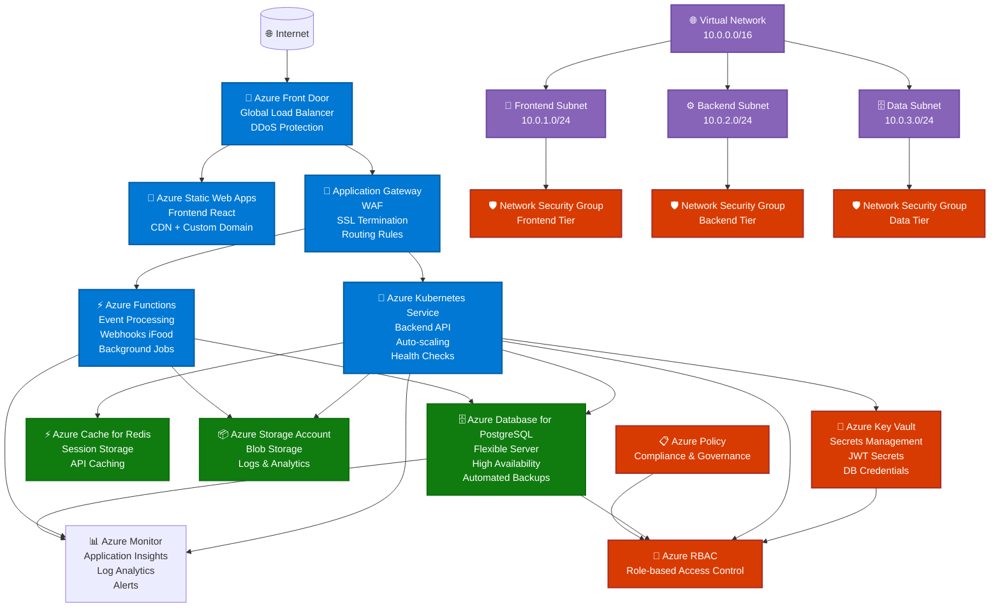

# Diagrama de Arquitetura Azure - Fratelli

## Arquitetura na Nuvem Azure

## Componentes da Arquitetura

### 🌐 Camada de Internet
- **Azure Front Door**: CDN global, proteção DDoS, balanceamento de carga
- **Custom Domain**: domínio personalizado com SSL/TLS

### 📱 Camada de Frontend
- **Azure Static Web Apps**: hospedagem do React SPA
- **CDN integrado**: entrega global de conteúdo estático
- **Custom Domain**: domínio personalizado com HTTPS

### ⚙️ Camada de Backend
- **Azure Kubernetes Service (AKS)**: orquestração de containers
- **Azure Functions**: processamento de eventos e webhooks
- **Auto-scaling**: escalonamento automático baseado em métricas

### 🗄️ Camada de Dados
- **Azure Database for PostgreSQL**: banco principal com alta disponibilidade
- **Azure Cache for Redis**: cache de sessões e API
- **Azure Storage**: armazenamento de logs e arquivos

### 🔒 Camada de Segurança
- **Azure Key Vault**: gerenciamento centralizado de segredos
- **Network Security Groups**: isolamento de rede por camadas
- **Azure RBAC**: controle de acesso baseado em funções

### 📊 Monitoramento e Governança
- **Azure Monitor**: monitoramento completo da aplicação
- **Application Insights**: telemetria e performance
- **Azure Policy**: conformidade e governança
